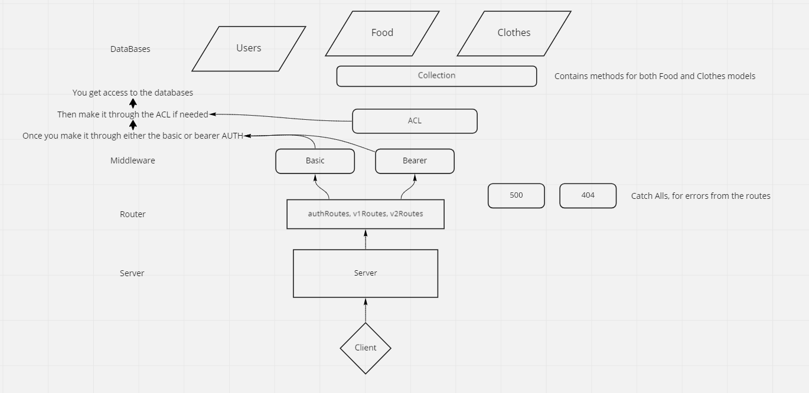

# auth-api

HTTP Express Server deployed on Heroku

## UML

## Installation

In order to install, run ```git clone git@github.com:<your website and repo here>```

cd into express-server-deployment

run npm install

## Usage

To run the server, use ```npm start```

In order to test the server, use ```npm test```

## Routes
### Auth Routes
- POST /signup; with data from the body or from form, creates a user, immediately hashes password, then stores user in database
- POST /signin; with data from the headers, gets user from database, and compares the hashed password in the database to the password input, either validates or rejects if password matches or does not match
- GET /users; with data from bearer, with token, will be able to access all the users who have been saved to the database
- GET /secret; with data form the bearer, with token, will access the 'secret area'

### Food/Clothes Routes
#### /api/v1 Routes That Do NOT Require Authorization
- POST /api/v1/food or /clothes; with data from the body, creates a new record in the respective table
- GET /api/v1/food or /clothes; will retrieve all of the records from either the food or clothes table
- GET /api/v1/food/:id or /clothes/:id; will retrieve the record from either table based on the :id number input for the request params
- PUT /api/v1/food/:id or /clothes/:id; will find and change the record from either table, based on the :id number input, and the data passed in the request body
- DELETE /api/v1/food/:id or /clothes/:id; will find a record in the table based off the :id number from request params and destroy it

#### /api/v2 Routes That DO Require Authorization
These routes below require authorization, meaning they will check which ___type___ of user is logged in, and either grant them permission to do the REST method or not. <br />
- The POST method requires _create_ permissions, which are granted to __writers__, __editors__ and __admins__. This route also requires __bearer authentication__, meaning it will look for a token from the bearer field in the header to grant permission.
  - POST /api/v2/food or /clothes; with data from the body, creates a new record in the respective table
- Both GET methods only require __basic authorization__, so they will look to the header for _username_ and _password_ to grant permission.
  - GET /api/v2/food or /clothes; will retrieve all of the records from either the food or clothes table
  - GET /api/v2/food/:id or /clothes/:id; will retrieve the record from either table based on the :id number input for the request params
- The PUT method requires _update_ permissions, which are granted to __editors__ and __admins__. This route also requires __bearer authentication__, meaning it will look for a token from the bearer field in the header to grant permission.
  - PUT /api/v2/food/:id or /clothes/:id; will find and change the record from either table, based on the :id number input, and the data passed in the request body
- The DELETE method requires _delete_ permissions, which are granted to only __admins__. This route also requires __bearer authentication__, meaning it will look for a token from the bearer field in the header to grant permission.
  - DELETE /api/v2/food/:id or /clothes/:id; will find a record in the table based off the :id number from request params and destroy it

## Features
### Auth Database
- User:
  - username
  - password
  - token; made using a getter, which runs a function when token property is called
  - role; user -> permissions: ( read ), writer -> permissions: ( read, create ), editor -> permissions: ( read, create, update ), admin -> permissions: ( read, create, update, delete ).
### Databases 
- Food: 
  - name
  - calories
  - type
- Clothes:
  - name
  - color
  - size

## URL's

- Pull Requests: https://github.com/daniel-jacks/auth-api/pulls
- GitHub Actions: https://github.com/daniel-jacks/auth-api/actions
- Deployed Main Branch: https://auth-api-danieljacks.herokuapp.com/